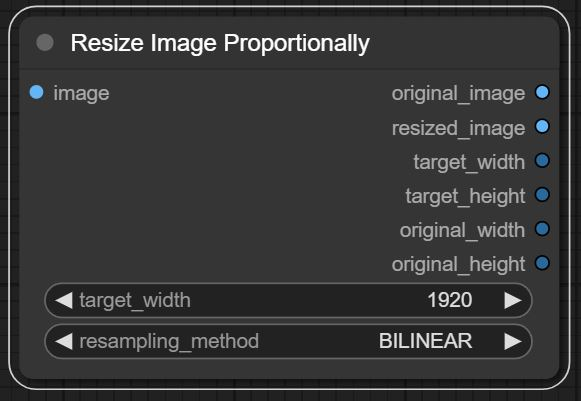
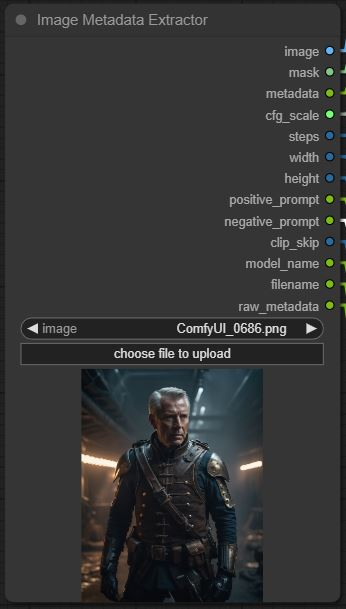
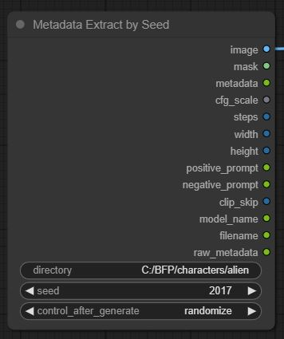

# ComfyUI-GG

**Developer:** Garner Games

**Version:** 1.1 
**Date:** 7/22/24

ComfyUI-GG is a collection of ComfyUI nodes designed to enhance productivity in image processing workflows. This plugin provides a set of custom nodes that perform various image manipulations and metadata extractions to streamline your tasks.

## Changelog

### Version 1.1 - 7/22/24
- Resolved issues with metadata extractor function.

## Nodes

### 1. Add Padding to Image
**Description:**  
This node adds pixel padding to the image to achieve a specified dimension.

**Usage:**  
- Input an image.
- Define the goal dimension.
- The node will add padding to the image to match the specified dimension.

---

### 2. Resize Image Proportionally
**Description:**  
This node resizes an image proportionally based on a user-defined width.

**Usage:**  
- Input an image.
- Define the new width.
- The node will resize the image proportionally to match the specified width.

---

### 3. Image Metadata Extractor
**Description:**  
This node loads an image and extracts its metadata, which can be used for additional image processing.

**Usage:**  
- Input an image.
- The node will extract and output the metadata from the image.

---

### 4. Metadata Extract by Seed
**Description:**  
This node iterates through images in a directory using a seed, loads each image, and extracts its metadata. This metadata can be used for upscale/resampling automation.

**Usage:**  
- Input a seed value.
- Provide the directory containing the images.
- The node will extract metadata from each image in the directory based on the seed.

---

